# Remote-SSHのためのSSH公開鍵認証のしくみ

対象: SSHや鍵認証に詳しくない人  
目的: VSCodeのRemote-SSHでLinuxに接続する前に、公開鍵と秘密鍵、`.ssh/config`、パスワードなし接続の関係を理解する

---

## 1. SSHとは

SSHは、手元のPCから離れたLinuxマシンに安全に接続するための仕組みです。

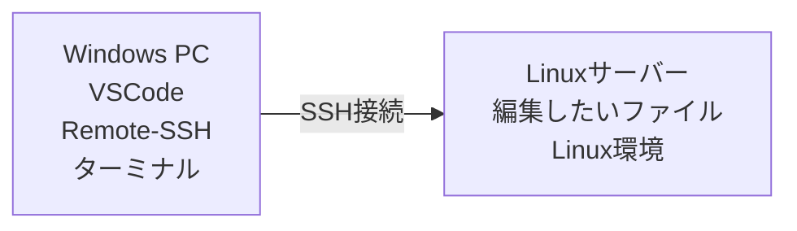

Remote-SSHを使うと、Windows PCでVSCodeを開きながら、実際にはLinux上のフォルダやファイルを編集できます。

---

## 2. SSH公開鍵認証で使う2つの鍵

SSH公開鍵認証では、2つの鍵をペアで使います。

| 鍵 | 置く場所 | 役割 | 他人に渡してよいか |
|---|---|---|---|
| 秘密鍵 | 自分のPC | 自分本人であることを証明する | 絶対に渡さない |
| 公開鍵 | 接続先のLinux | この秘密鍵の持ち主を許可する | 渡してよい |

図で表すと、次のようになります。

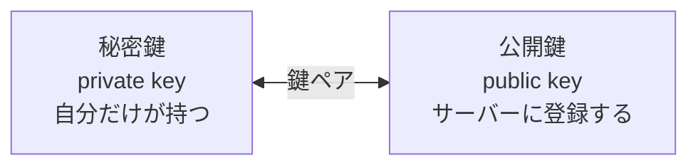

大事なのは、秘密鍵と公開鍵はペアですが、公開鍵から秘密鍵を作ることはできない、という点です。

---

## 3. 鍵はどこに置くのか

Remote-SSHでは、通常次のように配置します。

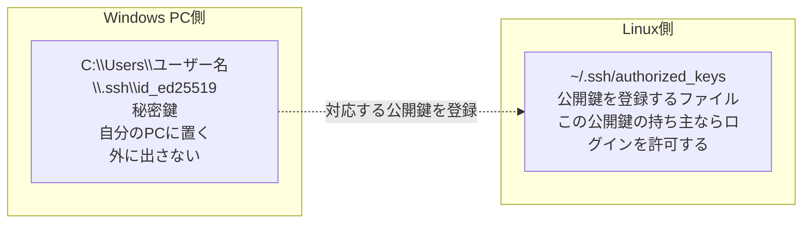

Linux側の `authorized_keys` は、「この公開鍵を持つ人のログインを許可するリスト」です。

---

## 4. ログイン時に何が起きているか

SSH公開鍵認証では、秘密鍵そのものをサーバーに送っているわけではありません。  
実際には、次のような流れで本人確認をします。

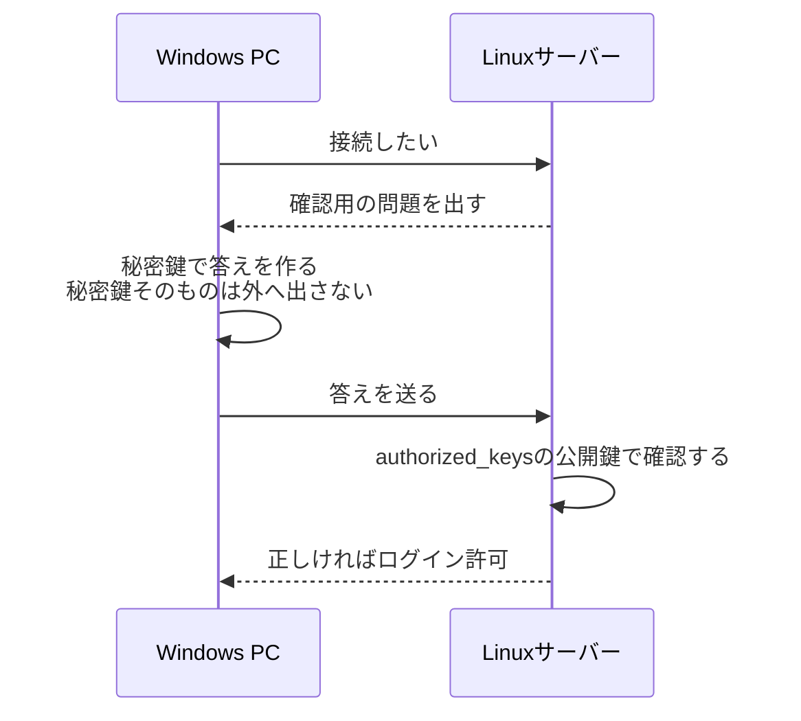

ポイントは次の2つです。

```text
秘密鍵は送らない
公開鍵で、秘密鍵を持っていることだけを確認する
```

---

## 5. なぜ安全なのか

公開鍵認証が安全なのは、次の性質があるからです。

| 仕組み | 意味 |
|---|---|
| 秘密鍵は自分のPCから出ない | 通信中に秘密鍵が盗まれにくい |
| 公開鍵だけではログインできない | 公開鍵を見られても、秘密鍵がなければ本人確認に通らない |
| サーバーは公開鍵で確認する | パスワードを送らずに本人確認できる |
| 秘密鍵にパスフレーズを付けられる | 秘密鍵ファイルが盗まれても、すぐには使われにくい |

パスワードログインとの違いは、次のように考えると分かりやすいです。

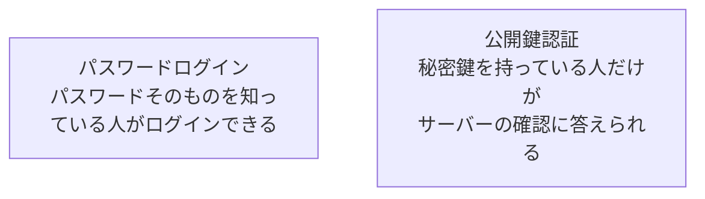

---

## 6. 公開鍵認証を家の鍵にたとえる

公開鍵認証は、次のようなイメージです。

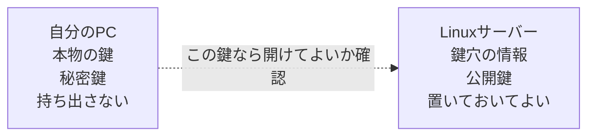

サーバー側に置くのは「鍵そのもの」ではなく、「この鍵なら開けてよい」と判断するための情報です。  
そのため、公開鍵はサーバーに登録してもよいですが、秘密鍵は絶対に渡してはいけません。

---

## 7. `.ssh/config` とは

SSHでは、接続先の情報を毎回コマンドに長く書かなくてもよいように、設定ファイルを使えます。  
Windows PC側では、通常 `C:\Users\ユーザー名\.ssh\config` に書きます。

たとえば、毎回このように入力する代わりに、

```text
ssh -i C:\Users\ユーザー名\.ssh\id_ed25519 user@example-linux.example.com
```

`.ssh/config` に設定を書いておくと、短い名前で接続できます。

```text
ssh my-linux
```

`.ssh/config` は、SSH接続のためのアドレス帳のようなものです。

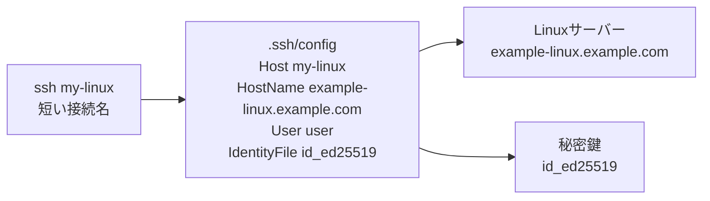

設定例は次の通りです。

```sshconfig
# C:\Users\ユーザー名\.ssh\config
Host my-linux
  HostName example-linux.example.com
  User user
  IdentityFile C:\Users\ユーザー名\.ssh\id_ed25519
```

各行の意味は次の通りです。

| 設定 | 意味 |
|---|---|
| `Host my-linux` | 自分で決める接続名。VSCodeやsshコマンドで使う |
| `HostName example-linux.example.com` | 実際のサーバー名またはIPアドレス |
| `User user` | Linuxにログインするユーザー名 |
| `IdentityFile ...` | 接続に使う秘密鍵ファイル |

この設定があると、VSCode Remote-SSHでは `my-linux` という接続先を選べるようになります。

---

## 8. パスワードなしで接続できるとは

ここでいう「パスワードなしでSSH接続する」とは、Linuxユーザーのログインパスワードを入力せず、秘密鍵で本人確認するという意味です。

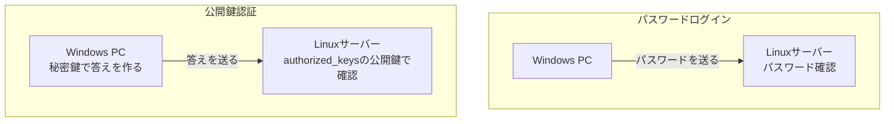

公開鍵認証が正しく設定できていれば、次のように短い名前で接続できます。

```text
ssh my-linux
```

接続時にLinuxユーザーのパスワードを聞かれなければ、公開鍵認証で接続できています。

ただし、秘密鍵にパスフレーズを設定している場合は、秘密鍵を使うためのパスフレーズを聞かれることがあります。  
これはLinuxのログインパスワードではなく、秘密鍵を守るためのパスフレーズです。

| 入力を求められるもの | 何のためのものか |
|---|---|
| Linuxユーザーのパスワード | パスワードログインのため |
| 秘密鍵のパスフレーズ | 秘密鍵ファイルを使うため |

説明会では、まず「Linuxユーザーのパスワードなしで接続できる状態」を目指します。

---

## 9. `.ssh/config` を使った接続の流れ

`.ssh/config` と公開鍵認証を組み合わせると、接続の流れは次のようになります。

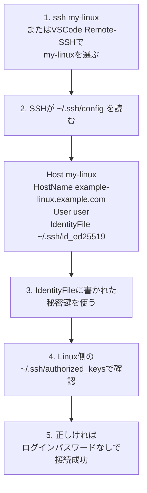

この構成にすると、参加者は接続先の長いホスト名や秘密鍵ファイルの場所を毎回入力する必要がありません。  
VSCode Remote-SSHでも、`.ssh/config` に書いた `Host` 名を選ぶだけで接続できます。

---

## 10. Remote-SSHでの接続イメージ

VSCodeのRemote-SSHでは、VSCodeが裏側でSSH接続を使います。

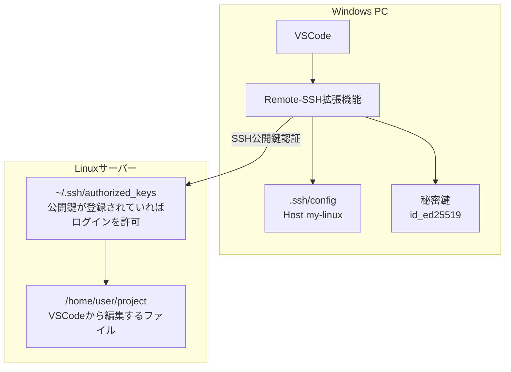

接続後は、WindowsのVSCode画面で操作していても、開いているフォルダやターミナルはLinux側のものになります。

---

## 11. セットアップで行うこと

SSH公開鍵認証のセットアップでは、基本的に次の作業を行います。

1. Windows PCで鍵ペアを作成する
2. 公開鍵をLinuxサーバーへ登録する
3. Windows PCの `.ssh/config` に接続先を書く
4. `ssh 接続名` でパスワードなし接続できることを確認する
5. VSCodeのRemote-SSHから同じ接続名を選ぶ

流れを図にすると次の通りです。

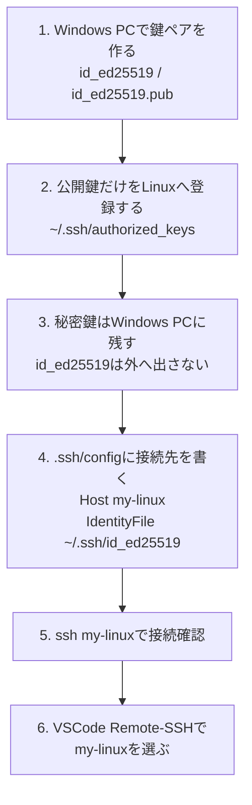

`.ssh/config` まで設定しておくと、VSCode Remote-SSHでも同じ `my-linux` を選べます。

---

## 12. よくある誤解

| 誤解 | 正しい理解 |
|---|---|
| 公開鍵を渡すと危険 | 公開鍵は渡してよい。秘密鍵は渡してはいけない |
| サーバーに秘密鍵を置く | サーバーに置くのは公開鍵。秘密鍵は自分のPCに置く |
| 公開鍵だけでログインできる | 公開鍵だけではログインできない。対応する秘密鍵が必要 |
| VSCodeが特別な接続をしている | Remote-SSHは裏側で通常のSSH接続を使っている |
| `.ssh/config` に書けば認証が不要になる | 認証は必要。接続情報と秘密鍵の場所を省略できるだけ |
| パスワードなし接続は危険 | 秘密鍵で本人確認している。秘密鍵の管理が重要 |
| 一度設定したら誰でも入れる | 秘密鍵を持つ人だけが入れる。秘密鍵の管理が重要 |

---

## 13. 参加者に伝える一言まとめ

```text
公開鍵はサーバーに登録する「許可リスト」
秘密鍵は自分だけが持つ「本人確認のための鍵」
.ssh/configは接続先と秘密鍵の場所を書く「SSHのアドレス帳」
ssh 接続名 でLinuxユーザーのパスワードなし接続を目指す
ログイン時に秘密鍵は送られない
```

Remote-SSHを使う前に、この3点を理解しておくと、SSH設定で何をしているのかが分かりやすくなります。
