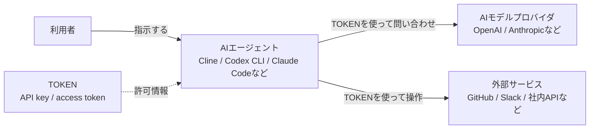

# 生成AIツールで使うTOKENの基本

対象: AIやITに詳しくない人  
目的: 生成AIモデルプロバイダや外部サービスと連携するときに使うTOKENについて、パスワードとの違い、メリット、注意点を理解する

---

## 1. TOKENとは

TOKENは、WebサービスやAPIにアクセスするための「許可証」のようなものです。

生成AIツールでは、次のような場面でTOKENを使います。

| 利用場面 | TOKENの例 |
|---|---|
| AIモデルプロバイダに接続する | OpenAI API key、Anthropic API key、Gemini API keyなど |
| GitHubを操作する | GitHub Personal Access Token、GitHub App tokenなど |
| Slackへ投稿する | Slack bot token、user tokenなど |
| 社内システムやSaaSと連携する | API token、OAuth access tokenなど |
| エージェントに外部サービスを扱わせる | MCP、API連携、CLI連携で使う各サービスのtoken |

初心者向けに言うと、TOKENは次のようなものです。

```text
パスワードそのものを渡す代わりに、
特定の作業だけを許可するための合い鍵
```

---

## 2. なぜTOKENが必要なのか

DX時代の作業では、1つのツールだけで完結しないことが増えています。

たとえば、AIエージェントに次のような作業を頼むことがあります。

```text
AIエージェントに頼みたいこと

- AIモデルプロバイダに問い合わせる
- GitHubのIssueを読む
- Pull Requestを作る
- Slackに結果を投稿する
- 社内APIからデータを取得する
- チケット管理ツールを更新する
```

これらのサービスは、誰でも自由に使えるわけではありません。  
そのため、「この人、またはこのツールには、ここまでの操作を許可する」という情報が必要になります。

その許可情報として使われるのがTOKENです。

---

## 3. パスワードとTOKENの違い

| 項目 | パスワード | TOKEN |
|---|---|---|
| 主な目的 | 人間がログインする | アプリ、CLI、AIエージェント、APIが操作する |
| 権限の細かさ | アカウント全体の権限になりやすい | 読み取りだけ、特定リポジトリだけ、特定APIだけなどに制限しやすい |
| 有効期限 | 長期間変わらないことが多い | 有効期限を設定できることが多い |
| 無効化 | パスワード変更が必要になることが多い | そのTOKENだけ削除・無効化できることが多い |
| 使う相手 | 主に人間 | プログラム、AIツール、外部サービス連携 |
| 漏えい時の影響 | アカウント全体に及びやすい | 権限や期限を絞っていれば影響を限定しやすい |

重要なのは、TOKENも秘密情報だという点です。  
パスワードより安全に扱える設計にしやすいだけで、漏れてよいものではありません。

---

## 4. TOKENを使うメリット

### 4.1. 権限を限定できる

TOKENは、できる操作を限定できます。

```text
例: GitHubのTOKEN

よくない例:
  すべてのリポジトリを読み書きできるTOKEN

よい例:
  特定のリポジトリだけ読めるTOKEN
  Issueだけ作成できるTOKEN
  Pull Requestだけ操作できるTOKEN
```

AIエージェントに渡すTOKENは、必要最小限の権限にします。

---

### 4.2. 取り消しやすい

TOKENは、不要になったらそのTOKENだけ無効化できます。

```text
パスワードが漏れた場合
  アカウント全体のパスワード変更が必要になりやすい

TOKENが漏れた場合
  漏れたTOKENだけ削除すればよい場合が多い
```

サービスごと、用途ごと、ツールごとにTOKENを分けておくと、問題が起きたときに止めやすくなります。

---

### 4.3. 有効期限を設定できる

TOKENには有効期限を設定できることがあります。

```text
短期利用のTOKEN
  説明会、検証、短期プロジェクト向き

長期利用のTOKEN
  運用ツール向き。ただし定期的な更新が必要
```

有効期限があるTOKENなら、消し忘れても将来使えなくなるため、リスクを下げられます。

---

### 4.4. 自動処理に使いやすい

AIエージェントやCLIツールは、人間のログイン画面を操作するのではなく、API経由でサービスを操作することが多いです。

```text
人間
  ブラウザでログインしてボタンを押す

AIエージェント / CLI / プログラム
  TOKENを使ってAPIにアクセスする
```

そのため、生成AIツールや自動化ツールではTOKENがよく使われます。

---

## 5. TOKENの種類

TOKENと呼ばれるものには、いくつか種類があります。

| 種類 | 説明 | 例 |
|---|---|---|
| API key | APIを使うためのキー | OpenAI API key、Anthropic API key |
| Personal Access Token | 個人アカウントの代わりにAPI操作するためのtoken | GitHub PAT |
| OAuth Access Token | OAuth認可で発行される短期token | Google、Slack、GitHub連携 |
| Refresh Token | Access Tokenを再発行するためのtoken | OAuth連携の裏側で使う |
| Bot Token | botとしてサービスを操作するためのtoken | Slack bot token |
| Session Token | ログイン状態を表す一時的なtoken | Webサービスのセッション |

説明会では、まず次のようにまとめると十分です。

```text
TOKEN = サービスに対する操作許可を表す秘密情報
API key = APIを使うためのTOKENの一種
```

---

## 6. AIエージェントでTOKENを使うイメージ

AIエージェントが外部サービスを扱うときは、TOKENを使ってアクセスします。



このとき、TOKENを持っているAIエージェントは、そのTOKENで許可された範囲の操作ができます。  
そのため、TOKENの権限は必要最小限にします。

---

## 7. TOKENを扱うときの基本ルール

| ルール | 理由 |
|---|---|
| TOKENをチャットに貼らない | AIツールやログに残る可能性がある |
| TOKENをソースコードに書かない | Gitに残ると漏えいしやすい |
| TOKENをREADMEや手順書に書かない | 共有された瞬間に漏えいする |
| 必要最小限の権限にする | 漏れたときの被害を小さくする |
| 用途ごとにTOKENを分ける | 問題が起きたときに止めやすい |
| 有効期限を設定する | 消し忘れのリスクを下げる |
| 使わなくなったTOKENは削除する | 古い入口を残さない |
| 漏えいしたらすぐ無効化する | 悪用される前に止める |

特に重要なのは、次の3つです。

```text
貼らない
書かない
必要最小限にする
```

---

## 8. TOKENをどこに置くか

TOKENは、ソースコードに直接書かず、環境変数や安全な保存場所に置きます。

| 置き場所 | 例 | 説明 |
|---|---|---|
| 環境変数 | `OPENAI_API_KEY` | CLIや開発環境でよく使う |
| `.env` ファイル | `.env` | ローカル開発で使う。ただしGit管理しない |
| Secret Manager | AWS Secrets Manager、GCP Secret Managerなど | 本番運用向け |
| GitHub Secrets | Repository secrets、Organization secrets | GitHub Actions向け |
| OSの資格情報管理 | Windows Credential Managerなど | PC上で安全に保存する仕組み |

ローカル開発で `.env` を使う場合は、必ず `.gitignore` に入れます。

```gitignore
.env
*.key
```

---

## 9. よくない例とよい例

### よくない例

```python
# よくない例: ソースコードにTOKENを書いている
OPENAI_API_KEY = "sk-xxxxxxxxxxxxxxxx"
```

このコードをGitHubにpushすると、TOKENが漏えいする可能性があります。

### よい例

```python
import os

api_key = os.environ.get("OPENAI_API_KEY")
```

このように、プログラムからは環境変数を読むようにします。  
TOKENそのものはコードに書きません。

---

## 10. TOKENが漏れたらどうするか

TOKENが漏れた、または漏れた可能性がある場合は、次の順番で対応します。

1. そのTOKENをすぐ無効化する
2. 新しいTOKENを作成する
3. 使っている環境変数や設定を差し替える
4. 不審な利用履歴がないか確認する
5. 必要なら管理者や関係者に連絡する

重要なのは、「あとで確認する」ではなく、まず無効化することです。

```text
TOKENは漏れたかもしれない時点で止める
```

---

## 11. パスワードとTOKENの使い分け

| 使うもの | 使う場面 |
|---|---|
| パスワード | 人間がWebサイトやサービスにログインするとき |
| TOKEN | アプリ、CLI、AIエージェント、APIがサービスを操作するとき |

参加者には、次のように説明すると分かりやすいです。

```text
パスワード = 人間がログインするためのもの
TOKEN = ツールやAIエージェントに限定的な作業を許可するためのもの
```

---

## 12. まとめ

TOKENは、DX時代の連携や自動化に欠かせない仕組みです。  
AIエージェントがAIモデルプロバイダやGitHub、Slack、社内APIなどを扱うときにも、TOKENを使います。

ただし、TOKENは便利な反面、秘密情報です。

```text
TOKENはパスワードの代わりに使う「限定付きの許可証」
権限を絞れる
取り消しやすい
有効期限を設定しやすい
でも漏えいしたら危険
```

安全に使うためには、次の考え方が重要です。

```text
必要な範囲だけ許可する
使わなくなったら消す
ソースコードやチャットに貼らない
```
